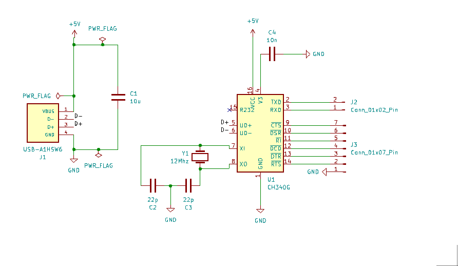
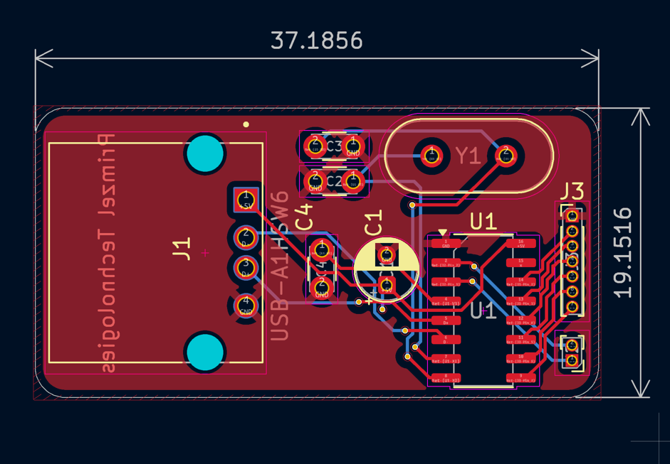
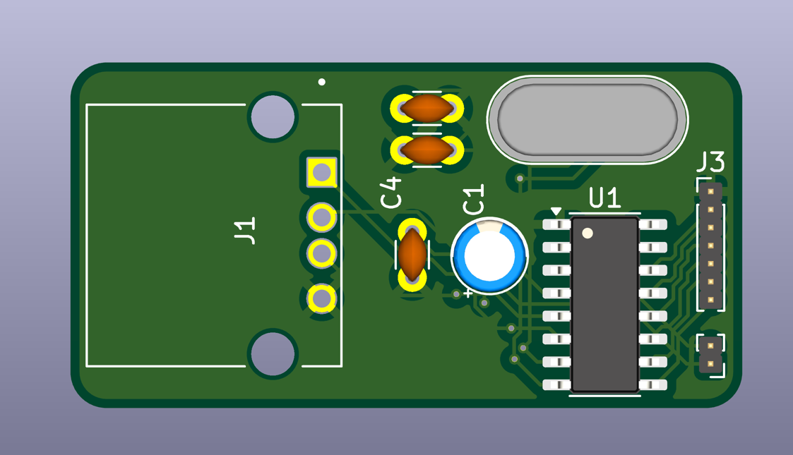

# CH340G Interface Board

This repository contains the design files and documentation for a CH340G Interface Board, which is used to facilitate
communication between a computer and microcontroller-based projects via USB.

### Screenshots

